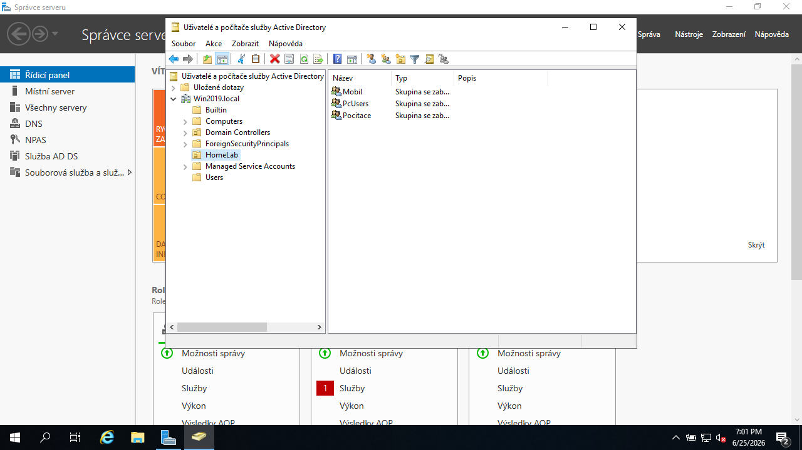
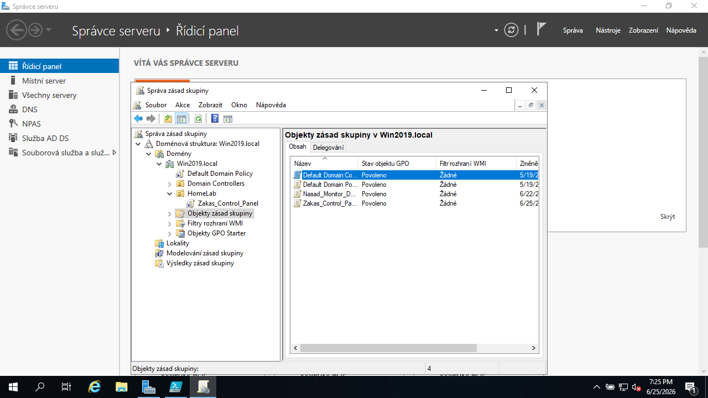
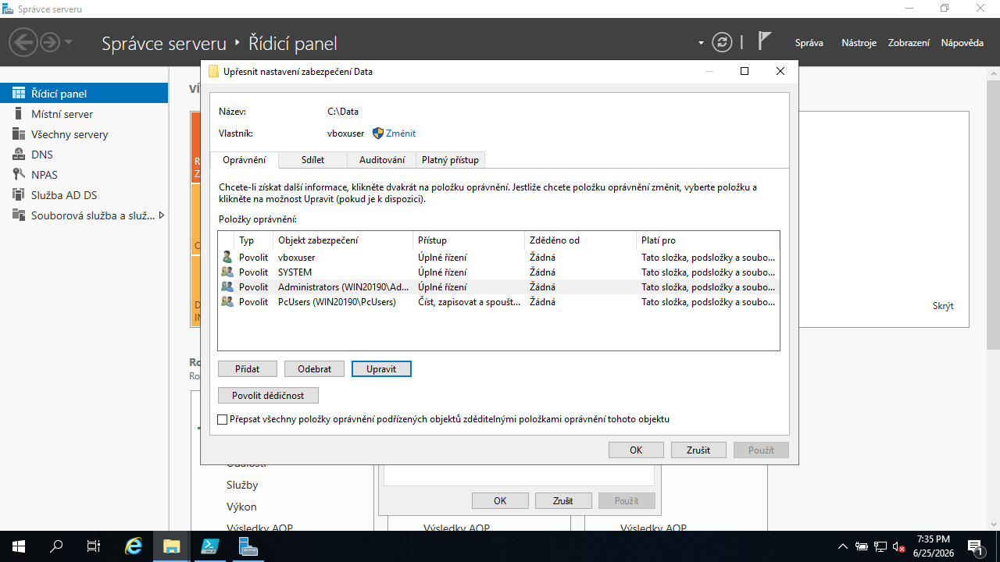
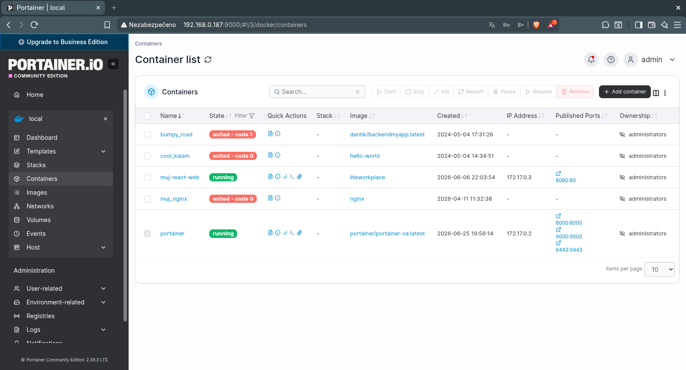
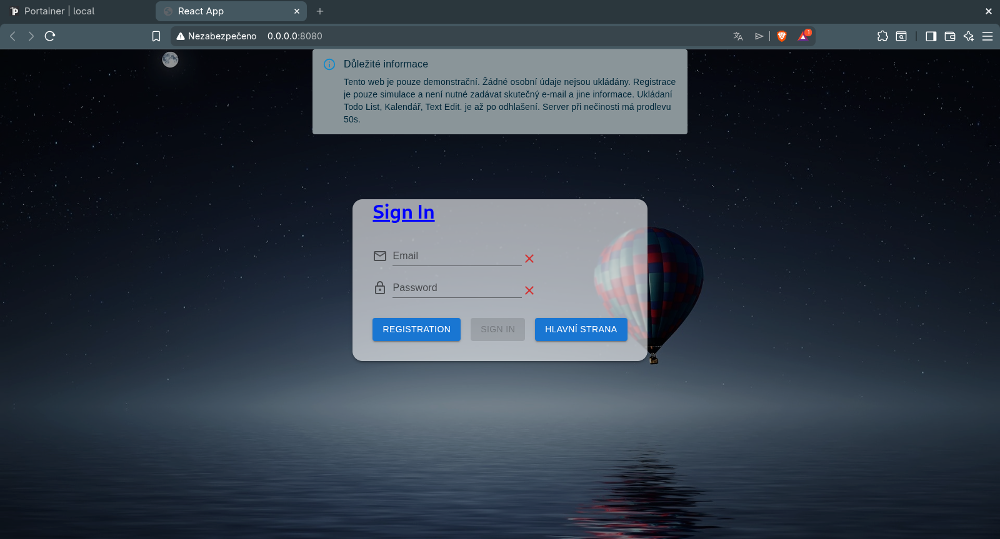

# Můj Hybridní Home-Lab 🚀

Ahoj! Tady mám zdokumentované svoje testovací prostředí, které mi běží doma. Nechtěl jsem se učit teorii jen z knížek, tak jsem si postavil vlastní síť, kde kombinuju Windows Server pro správu uživatelů a Linux/Docker pro provozování webů. 

Ukazuju tím, že sice hledám svoji první juniorní pozici, ale základy z inzerátů už mám osahané z praxe v labu.

---

## 🛠️ Co mi v labu běží a co s tím dělám

### 🖥️ Windows Server 2019 (Firemní síť)
Tady simuluju klasické kancelářské prostředí.
* **Active Directory:** Mám založenou testovací firmu, vytvořené organizační jednotky (OU) a uživatele.
* **GPO (Skupinové politiky):** Testuju, jak uživatelům hromadně zakázat blbosti, nastavit jim tapetu nebo automaticky namapovat síťové disky.
* **Sdílené složky:** Nastavená NTFS práva (kdo kam může a nemůže).

#### 📸 Ukázka konfigurace Windows:

* **Struktura Active Directory (OU):**
    

* **Správa Group Policy (Zákaz Control Panelu pro OU HomeLab):**
    

* **Nastavení NTFS práv na sdílené složce:**
    

---

### 🐧 Linux (Ubuntu) + Docker & Portainer
Tohle mě baví, protože to má blízko k modernímu hostingu. Běží mi to na mém samostatném fyzickém PC vedle na stole.
* **Docker & Portainer:** Služby nespouštím napřímo, ale balím je do kontejnerů a spravuju je přes webové rozhraní Portaineru.
* **Nginx:** Používám ho jako reverzní proxy – stará se o to, aby se požadavky zvenku správně nasměrovaly do mých Docker kontejnerů.

#### 📸 Ukázka konfigurace Linuxu a webu:

* **Přehled běžících kontejnerů v Portaineru:**
    

* **Výsledná aplikace běžící v prohlížeči:**
    

---

## 🎯 Co mám v plánu dodělat v nejbližších dnech?
* Nasadit **Uptime Kuma** nebo **Netdata** pro monitoring, abych viděl, kdyby mi nějaký kontejner spadl.
* Napsat si jednoduchý **Bash skript** na automatické zálohování databází.
